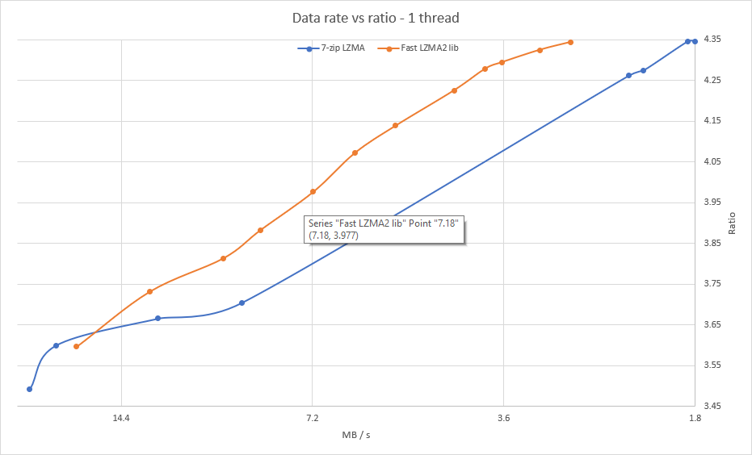

 The Fast LZMA2 Library is a lossless high-ratio data compression library based on the LZMA2 codec in 7-zip.

The library uses a parallel buffered radix matchfinder and some optimizations from Zstandard to achieve a 50% to 80%
speed gain over 7-zip at the higher levels. It also uses some threading, portability, and testing code from Zstandard.

Tested vs 7-zip LZMA on the [Silesia compression corpus] using one thread.

[Silesia compression corpus]: http://sun.aei.polsl.pl/~sdeor/index.php?page=silesia

Compression data rate vs ratio
------------------------------

### Build

The library is work in progress, so currently only a VS 2015 project is available for building.
If anyone would like to contribute files for make, cmake, or other build systems, please do so.

### Status

A significant amount of testing has already been done, but the library is in beta and is unsuitable for production environments.

### License

Fast LZMA2 is dual-licensed under [BSD](LICENSE) and [GPLv2](COPYING).

### Contributing

Please use the "dev" branch for all proposed contributions.
