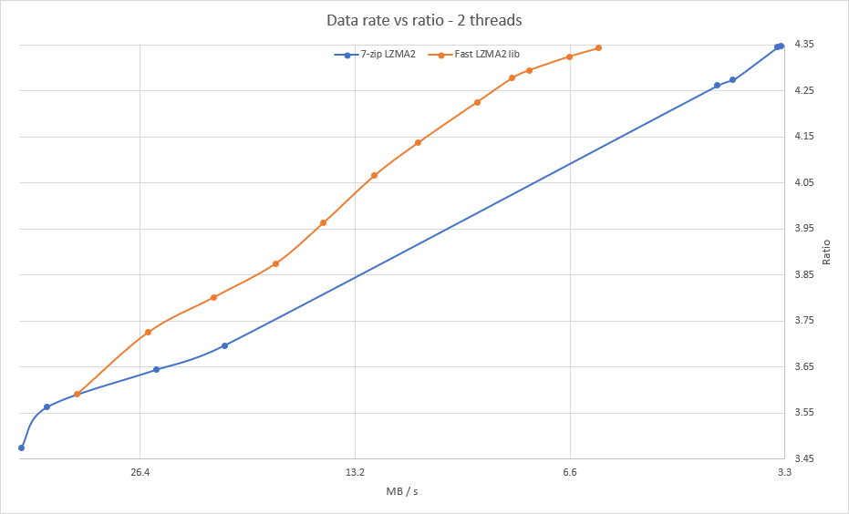

 The __Fast LZMA2 Library__ is a lossless high-ratio data compression library based on the LZMA2 codec in 7-zip.

Binaries of a 7-Zip fork using the algorithm are available in the [7-Zip-FL2 project].

[7-Zip-FL2 project]: https://github.com/conor42/7-Zip-FL2/releases/

The library uses a parallel buffered radix matchfinder and some optimizations from Zstandard to achieve a 20% to 100%
speed gain over 7-zip at the higher levels, depending on the source data. It also uses some threading, portability, and testing code
from Zstandard.

Use of the parallel buffered radix matchfinder instead of BT4 allows multithreaded execution with a simple design and low memory
requirement. The library can compress using many threads without dividing the input into large chunks. Extra
memory used per thread is typically no more than a few megabytes, unlike 7-zip in which memory usage scales with the number of threads.

The largest caveat is that the matchfinder is a block algorithm, and to achieve about the same ratio as 7-zip requires double the
dictionary size, which raises the decompression memory usage. However a reduced dictionary size results in only a small loss of ratio.
A high-compression option is provided to select parameters which achieve higher compression on smaller dictionaries. The speed/ratio
tradeoff is less optimal with this enabled, but it is still normally faster than BT4.

Tested in memory vs the 7-zip LZMA2 encoder on the [Silesia compression corpus] using two threads. The design goal for the encoder and
compression level parameters was to move the line as far as possible toward the top left of the graph. This provides an optimal
speed/ratio tradeoff.

[Silesia compression corpus]: http://sun.aei.polsl.pl/~sdeor/index.php?page=silesia

Compression data rate vs ratio
------------------------------

### Build

The library is work in progress, and build methods aren't comprehensive for all systems. There are VS 2015 projects for building a
benchmark program, fuzz tester, and a DLL. Makefiles for gcc are included for the benchmark, fuzzer and DLL, and user nemequ has
contributed a CMake file. If anyone would like to help improve the build methods, please do so.

### Status

A significant amount of testing has already been done, but the library is in beta and is unsuitable for production environments.

Changes in v0.9.1:

- Fixed a bug in compression of very small files when using a high search depth.
- Added an incompressibility checker which processes high-entropy (e.g. encrypted or
  already compressed) data about twice as fast as before.

### License

Fast LZMA2 is dual-licensed under [BSD](LICENSE) and [GPLv2](COPYING).
